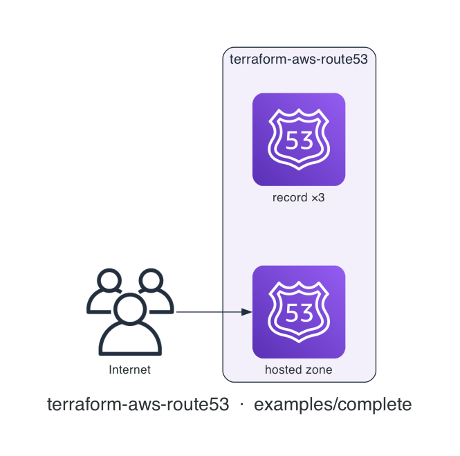

# terraform-aws-route53

[](https://github.com/devotica-labs/terraform-aws-route53/actions/workflows/ci.yml)
[](https://github.com/devotica-labs/terraform-aws-route53/actions/workflows/release.yml)
[](LICENSE)

> Part of the **Devotica** Terraform catalog. Follows the cloudposse module standard (README.yaml-driven docs, the `enabled`/`namespace`/`environment`/`stage`/`name`/`attributes`/`tags`/`label_order` label surface, `examples/complete`, Makefile targets) implemented **natively** — no external naming or build-harness dependencies.

## Introduction

Terraform module for an **Amazon Route 53 hosted zone** — public or private — plus a map of DNS records. One input creates the zone, another declares the records: plain records (`ttl` + `records`) and alias records (an `alias` block to an ALB, CloudFront, S3 website, or another Route 53 target) live side by side in the same `records` map.

Supplying `vpc_ids` associates one or more VPCs and makes the zone **private** (resolvable only inside those VPCs); leaving it empty creates a **public** zone whose `name_servers` you delegate to at the registrar. The fintech default is **`force_destroy` off**, so a zone that still resolves names can't be torn down by accident.

## Architecture

<!-- BEGIN_ARCH -->



<sub>Generated by `.github/workflows/architecture-diagram.yml` on every push to main. Do not edit the image by hand — change the Terraform code in `examples/complete/` and the bot will regenerate it.</sub>

<!-- END_ARCH -->

## Usage

Public zone with an apex A-alias pointing at an ALB:

```hcl
module "route53" {
  source  = "devotica-labs/route53/aws"
  version = "~> 0.1"

  namespace = "dvtca"
  stage     = "prod"
  name      = "dns"

  zone_name = "example.com"

  records = {
    apex = {
      name = "example.com"
      type = "A"
      alias = {
        name                   = module.alb.dns_name
        zone_id                = module.alb.zone_id
        evaluate_target_health = true
      }
    }
  }

  tags = local.tags
}
```

A private zone with a mix of plain record types:

```hcl
module "route53" {
  source  = "devotica-labs/route53/aws"
  version = "~> 0.1"

  namespace = "dvtca"
  stage     = "prod"
  name      = "internal"

  zone_name = "internal.example.com"
  vpc_ids   = [module.vpc.vpc_id]   # non-empty → private zone

  records = {
    db    = { name = "db.internal.example.com", type = "A", ttl = 300, records = ["10.0.12.34"] }
    cache = { name = "cache.internal.example.com", type = "CNAME", ttl = 300, records = ["my-redis.aps1.cache.amazonaws.com"] }
    spf   = { name = "internal.example.com", type = "TXT", ttl = 3600, records = ["v=spf1 -all"] }
  }
}
```

See [`examples/basic`](examples/basic) and [`examples/complete`](examples/complete).

## Defaults that matter

| Setting | Default | Why |
|---------|---------|-----|
| `force_destroy` | `false` | A zone that still resolves names can't be destroyed by accident; deleting it must be a deliberate act. |
| `vpc_ids` | `[]` | Empty → a public zone. A non-empty list associates VPCs and makes the zone private. |
| `comment` | `"Managed by Terraform"` | Marks the zone as module-managed in the console. |
| record shape | `alias` XOR `ttl`+`records` | Each record is validated to be exactly one of an alias record or a plain record; `ttl` is omitted for aliases. |

## How this fits the Devotica catalog

`terraform-aws-alb` and `terraform-aws-vpc` are the usual companions: point an alias record at the ALB (`module.alb.dns_name` / `module.alb.zone_id`) for public traffic, or attach a private zone to `module.vpc.vpc_id` for internal service discovery.

## Makefile Targets

```
make fmt       # terraform fmt -recursive
make validate  # terraform init -backend=false && terraform validate
make test      # terraform test (unit + contract; integration needs AWS creds)
make readme    # regenerate the terraform-docs block below
```

<!-- BEGIN_TF_DOCS -->
<!-- terraform-docs regenerates this block via `make readme` / CI. Inputs and
     outputs are documented in variables.tf and outputs.tf. -->
<!-- END_TF_DOCS -->

## License

[Apache 2.0](LICENSE) © Devotica
